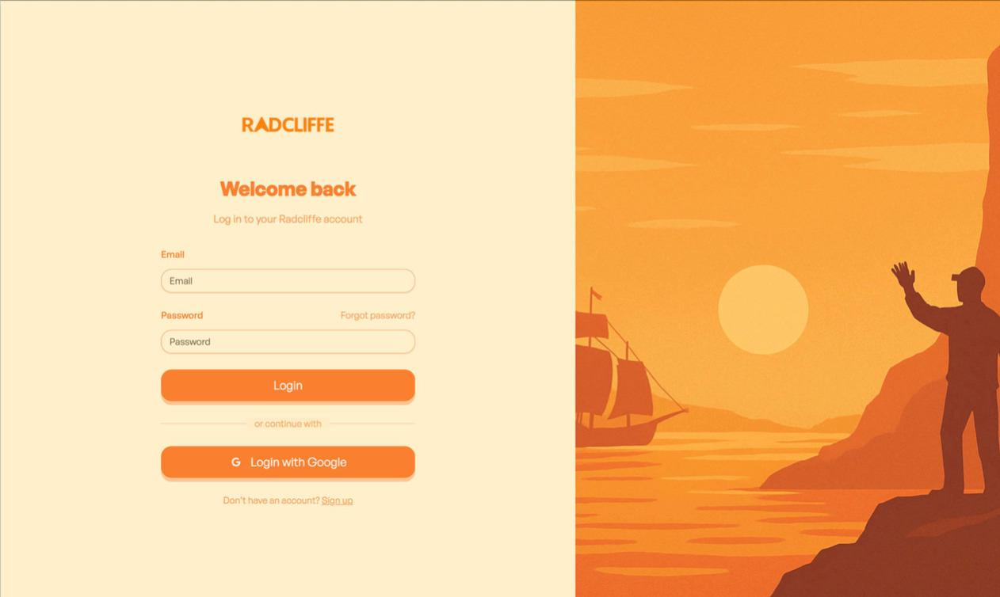
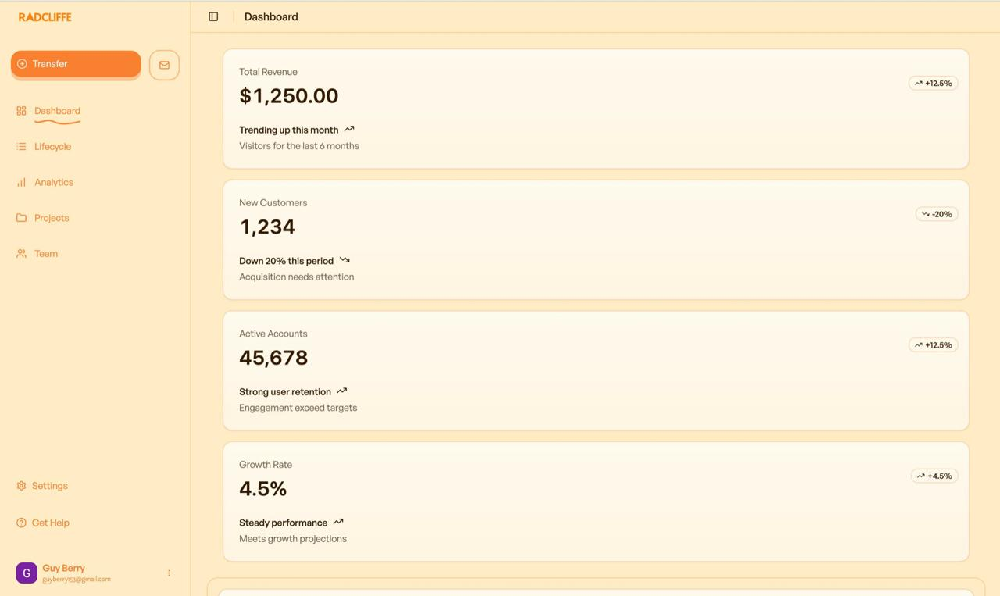
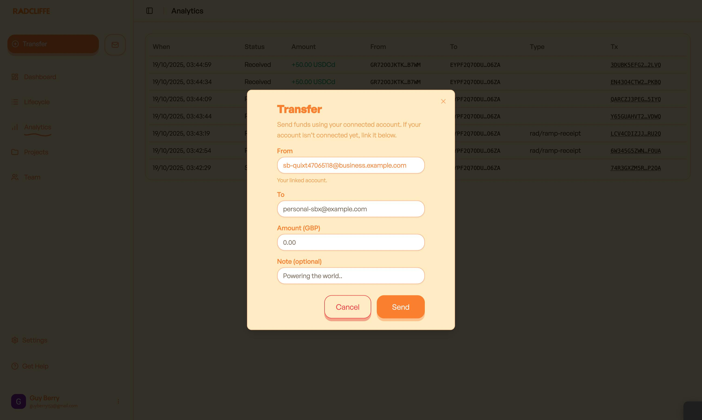

# hackathon

This code has been written solely during the hackathon timeframe. There has been AI-Generated Code and some open-source samples have been used from the following sources:

- Shadcn/UI
- MagicUI
- CodePen

## Setup

To run this project there are three areas of setup --- it is advised to have three terminals open to make it easier
to manage.

1. Using cd hackathon/projects/hackathon-frontend please run **npm run dev** to run the frontend environment which will be found at default
   location of **http://localhost:5173**
2. Using cd hackathon-contracts/smart-contracts/backend please run **npm run dev** to run the frontend environment which will be found at default
   location of **http://localhost:5173**
3. At root level run **alogkit localnet start** to initiate a local version of algorand blockchain

### Subsequently

1. If you update to the latest source code and there are new dependencies, you will need to run `algokit project bootstrap all` again.
2. Follow step 3 above.

## Tools

This project makes use of Python and React to build Algorand smart contracts and to provide a base project configuration to develop frontends for your Algorand dApps and interactions with smart contracts. The following tools are in use:

- Algorand, AlgoKit, and AlgoKit Utils
- Python dependencies including Poetry, Black, Ruff or Flake8, mypy, pytest, and pip-audit
- React and related dependencies including AlgoKit Utils, Tailwind CSS, daisyUI, use-wallet, npm, jest, playwright, Prettier, ESLint, and Github Actions workflows for build validation

## Features

This features a landing page that can run -- a mailing list has been adeded which links to Firebase under the hood to capture within a collection

Most of navbar remains incomplete but login button is fully functional as Google Auth/OAuth has been configued to use Google Sign Up/Log in or email and password. It works with firebase too. This will then take you to a custom dashboard. The dashboard features primarily dummy data but analytics tracks user transactions that have been completed on radcliffe platform

Moreover, the complexity lies under the hood. When a user creates an account -- a wallet is created automatically on the blockchain for that user, abstracing all complexity inculding mnemonic phrase.

A user is actually able to complete transactions on the platform using only fiat! For now, it remains using a sandboxed Paypal environment which is requested when Transfer is attempted by clicking Transfer. Then, the user is able to transer fiat directly to another fiat wallet all powered by crypto. It has all been abstracted the user only has to know what the target email is and their own!

This is done by using Binance Test API to use accurate spots to convert to stablecoins and kept in the wallet before then being converted into fiat once again and transfered into user's other sandboxed paypal account*. This enables for the transaction to be recorded as well as recipient, amount fee and more which is fed into the analytics page on the website.

* Currently only creator of project paypal (bussiness/personal) account has been tested

## Smart contract

This project is fundamentally underpiined by one large smart contract which is the essential element in ensuring that any one, crypto native or not, can have their finances enabled by the security and speed of the blockchain. In the path of **cd hackathon/projects/hackathon-contracts/smart_contracts/hackathon/src/hackathon/contract.py**, this smart contract creates a mapping of an email (sha56) to a wallet address that enables the user not to worry about any aspect of management such as mnemonic passwords and more. Once a user is approved, there are helper function that calculate minimum balance (_box_mbr_fee) to ensure it is able to be ready to deploy transactions as well as being wrapped in a box so that only an email is required to be part of Algorand. This was definitely a hard part of the project but it was so vital in ensuring that anyone can access crypto and not have to be an expert on the technology that underpins it!

## Images

### Landing Page

*The initial entry point — a simple, visually appealing landing page that introduces the concept of on/off-ramp finance and invites users to sign up or log in.*

---

### Login Page

*Login and registration page with Google OAuth and Firebase authentication integration. This abstracts wallet creation under the hood.*

---

### Dashboard

*Custom dashboard view showing transaction summaries, PayPal linking status, and wallet analytics for the user.*

---

### Transfer Flow

*Transfer interface that connects PayPal sandbox accounts, enabling fiat-to-crypto and crypto-to-fiat transfers seamlessly via Binance as CEX.*

## Playthrough

### Demo Video (MP4)
[ Watch the main demo video](./videos/demo_video.mp4)

*This MP4 demo provides a concise visual overview of the system — highlighting smart contract deployment, on-chain wallet creation, and the fiat ↔ crypto flow in real time.*

---

### Full Playthrough (MOV)
[ Watch the full playthrough video](./videos/playthrough.mov)

*This longer recording shows the complete user experience from login to executing a PayPal-backed transfer and viewing the blockchain receipt, step-by-step through the working interface.*

## Next Steps

This is an early-stage project that has not been fully completed -- end-to-end encryption will be the next step so that there is no knowledge of what is happening from the centralised CRUD app to ensure a quick, cheap and complete defi experience.
